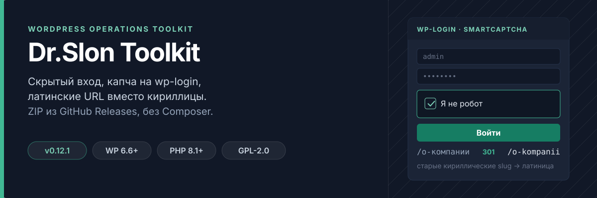
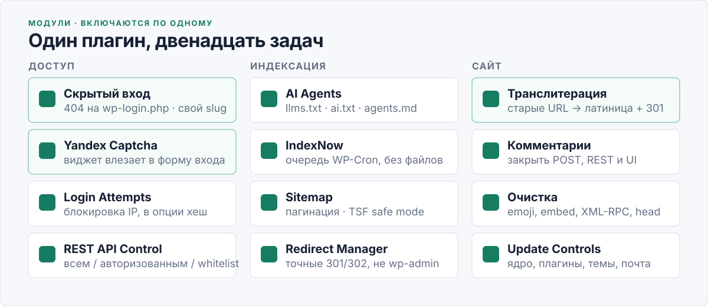
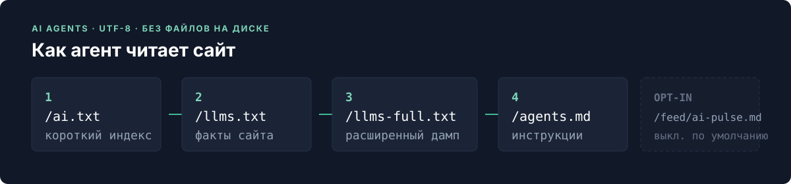

<p align="center">
  
</p>

Модульный плагин WordPress для обслуживания клиентских сайтов: скрытый вход, REST, IndexNow, sitemap, транслитерация и AI-документы. На сервере клиента Composer не нужен.

**[Скачать dr-slon-toolkit-0.11.0.zip](https://github.com/A-Krivoshen/dr-slon-toolkit/releases/latest)** · не кнопку **Code → Download ZIP**

## Установка

1. Откройте [Releases](https://github.com/A-Krivoshen/dr-slon-toolkit/releases/latest).
2. Скачайте **`dr-slon-toolkit-x.y.z.zip`** (asset релиза, не Source code).
3. В WordPress: **Плагины → Добавить новый → Загрузить плагин**.
4. Активируйте и настройте меню **Dr.Slon Toolkit**.

WordPress 6.6+, PHP 8.1+.

С `0.9.0` обновления приходят из GitHub Releases: только ZIP-asset `dr-slon-toolkit-<version>.zip`, с проверкой SHA-256, размера, версии и структуры. Source archives GitHub не используются. Переход с `0.8.2` — один раз вручную этот ZIP.

## Что умеет

<p align="center">
  
</p>

| Модуль | Что делает |
| --- | --- |
| **Скрытый вход** | 404 на прямой `wp-login.php` (кроме reset/recovery). Вход по slug, например `/my-login/`. Аварийно: `define('KRV_DSTK_DISABLE_HIDE_LOGIN', true);` в `wp-config.php`. |
| **REST API Control** | Всем / только авторизованным / whitelist. Системный allowlist WordPress нельзя выключить. |
| **IndexNow** | Ручная и автоматическая отправка URL через очередь WP-Cron. Ключ `/<key>.txt` без файла на диске. Учитывает noindex/canonical The SEO Framework. |
| **Sitemap** | `/sitemap.xml` с пагинацией, кешем и `lastmod`. Если TSF отдаёт свою карту — toolkit не дублирует. |
| **AI Agents** | `/ai.txt`, `/llms.txt`, `/llms-full.txt`, `/agents.md`. Pulse выключен по умолчанию. |
| **Update Controls** | Автообновления ядра, плагинов, тем, переводов и писем. |
| **Транслитерация** | Русские slug и имена файлов. Уже опубликованные URL не переписывает. |
| **Комментарии** | Глобально закрывает комментарии, пинги, REST и UI. |
| **Очистка** | Emoji, wp-embed, XML-RPC, лишние теги `<head>`. |
| **Yandex SmartCaptcha** | Капча на форме входа. Ключи из Yandex Cloud. Не трогает reset password и XML-RPC. |
| **Login Attempts** | Блокирует IP после серии неверных паролей. В опции хранится хеш, не сырой адрес. |
| **Redirect Manager** | Точные 301/302: `/staryj/ -> /novyj/`. Не перехватывает wp-admin, login и REST. |

Страница настроек нативная. Карточки поддержки локальные, без удалённого JavaScript.

## AI Agents

<p align="center">
  
</p>

Модуль по умолчанию выключен. После включения:

| URL | По умолчанию |
| --- | --- |
| `/ai.txt` | вкл |
| `/llms.txt` | вкл |
| `/llms-full.txt` | вкл |
| `/agents.md` | вкл |
| `/feed/ai-pulse.md` | выкл |

Документы собираются на лету, UTF-8 без BOM. Можно оставить только llms без pulse. Гибрид: автоиз WordPress + ручные поля (кто/что, контакты, факты, политика). Вкладка **AI Agents**: статус, превью URL, сброс кеша.

Если активен The SEO Framework, sitemap toolkit не дублирует его карту. IndexNow и AI Agents учитывают noindex и внешний canonical.

## Разработка

Composer нужен только разработчику.

```bash
composer install
composer check
```

Runtime-зависимостей нет: релизный ZIP несёт production `vendor/autoload.php`, исходное дерево — встроенный PSR-4 loader для `src/`.

```bash
composer build-release
```

Скрипт собирает `dist/dr-slon-toolkit-<version>.zip` с корнем `dr-slon-toolkit/`. В архиве: `src/`, `assets/admin/`, production autoload, главный файл, uninstall, readme, license. Нет `.git`, тестов, `composer.json` и документации разработки.

Публикация: версии в `dr-slon-toolkit.php` и `Stable tag` в `readme.txt` совпадают, пуш в `main`, тег `vX.Y.Z`. Workflow `.github/workflows/release.yml` собирает ZIP и создаёт GitHub Release.

## Лицензия

GPL-2.0-or-later — [LICENSE](LICENSE).
